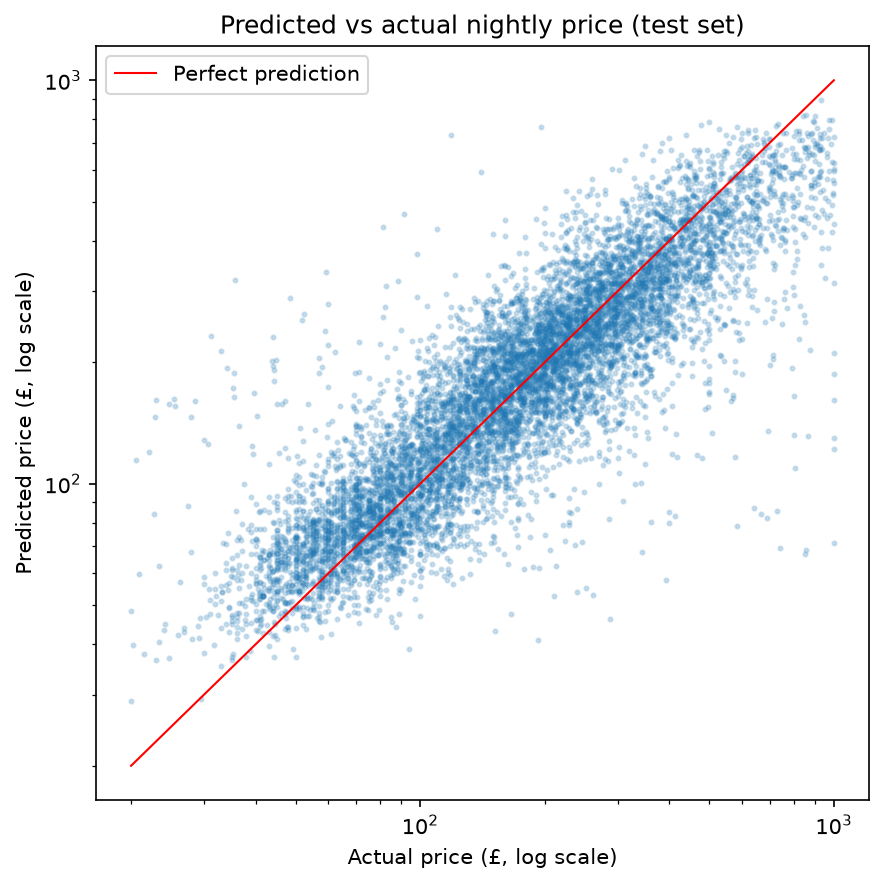
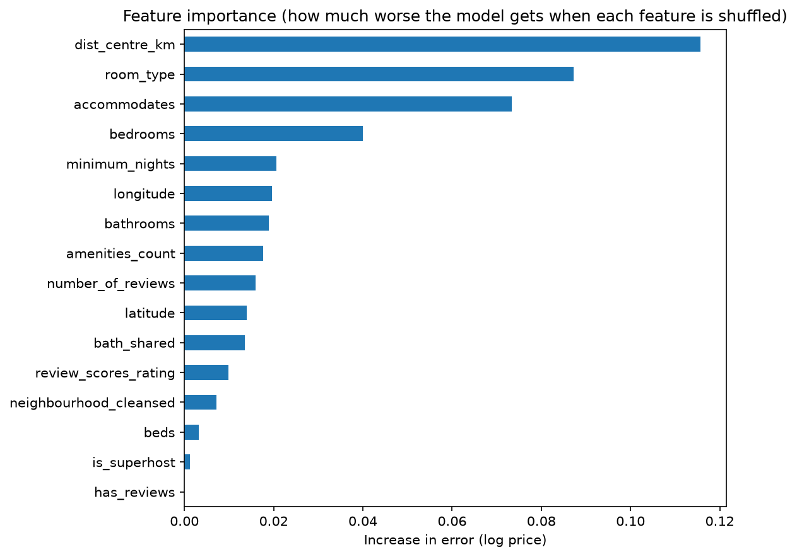

# London Airbnb Price Predictor

A machine learning model that predicts the nightly price of a London Airbnb listing, deployed as an interactive web app.

**👉 [Try the live app](https://london-airbnb-price-predictor.streamlit.app/)**
*(If the app has gone to sleep after a period of inactivity, click the button to wake it up. It takes about a minute.)*

## Results

On listings it had never seen, the final model predicts prices **within about 20% for a typical listing**, more than halving the error of a simple baseline.

| Model | Average error (MAE) | Typical % error | R² |
|---|---|---|---|
| Baseline (median price for every listing) | £120.8 | 48.8% | 0.00 |
| Linear regression | £68.1 | 23.8% | 0.68 |
| Random forest | £56.5 | 19.6% | 0.76 |
| **Gradient boosting (final model, test set)** | **£57.0** | **20.2%** | **0.76** |

Gradient boosting was chosen over the random forest because it matched its accuracy while being about **150 times smaller** (2.2 MB vs 337 MB), making it practical to store on GitHub and fast to load in the web app.



## What drives the price



- **Distance to central London** is the most important factor. This feature was engineered from each listing's coordinates using the haversine formula. Raw latitude and longitude barely correlate with price, because prices fall away from the centre in every direction, but distance captures this clearly.
- **Room type** comes next: entire homes have a median price of £235 a night, compared with £82 for private rooms.
- **Number of guests** and **bedrooms** follow, as larger properties cost more.

## Approach

1. **Exploration** ([notebook](notebooks/01_exploration.ipynb)): analysed 92,638 London listings. About a third had no price and were excluded. Prices were heavily skewed (median £180, maximum £527,524 a night), so listings outside £20–£1,000 were removed as likely errors or a separate luxury market, and the model predicts log(price).
2. **Cleaning and feature engineering** ([notebook](notebooks/02_cleaning_and_features.ipynb)): filled missing bathroom counts from a text column (reducing missing values from 6,421 to 99), and created features for distance to the centre, shared bathrooms, number of amenities and whether a listing has reviews. Columns calculated from price were excluded to avoid data leakage, and personal data such as host names was dropped.
3. **Modelling** ([notebook](notebooks/03_modelling.ipynb)): split the data into training (70%), validation (15%) and test (15%) sets. Models were compared on the validation set, and the test set was used once for the final score. Missing values and categories were handled inside scikit-learn pipelines so these steps learned only from the training data.
4. **Model insights** ([notebook](notebooks/04_model_insights.ipynb)): used permutation importance to explain the model and analysed where its errors are largest.
5. **Web app** ([code](app/app.py)): built with Streamlit and deployed on Streamlit Community Cloud.

## Limitations

- The model is most accurate for mid-priced listings (about 18% typical error for £150–£300) and less accurate at the extremes (about 27% for £20–£75 and 26% for £500–£1,000). It tends to over-predict cheap listings and under-predict expensive ones.
- About a third of listings had no price and were excluded, so the model reflects listings that were open for booking when the data was collected.
- The data is a single snapshot, so seasonal price changes aren't captured.
- In the app, location is approximated by the typical location of listings in the chosen borough.
- The model doesn't use photos, descriptions or property quality, which likely explain much of the remaining error.

## Possible improvements

- Add features from listing descriptions and specific amenities (for example, air conditioning or a garden).
- Combine snapshots from across the year to capture seasonality.
- Let app users enter a postcode for a more precise location.

## Project structure

```
├── app/                  # Streamlit web app and its requirements
├── models/               # Trained model and app metadata
├── notebooks/            # Exploration, cleaning, modelling and insights
├── reports/figures/      # Charts used in this README
├── src/                  # Script that builds the app's metadata
└── requirements.txt      # Packages for running the notebooks
```

## Running it yourself

```bash
git clone https://github.com/Astargame/london-airbnb-price-predictor.git
cd london-airbnb-price-predictor
python3 -m venv .venv
source .venv/bin/activate
pip install -r requirements.txt
```

Download the London `listings.csv.gz` file from [Inside Airbnb](https://insideairbnb.com/get-the-data/) into `data/raw/`, run the notebooks in order, then start the app with:

```bash
streamlit run app/app.py
```

## Data

London listings data from [Inside Airbnb](https://insideairbnb.com/), collected on 19 June 2026. Inside Airbnb is an independent project and is not affiliated with Airbnb.

## Tools

Python, pandas, NumPy, scikit-learn, Matplotlib, Streamlit, Jupyter, Git and GitHub.
